# Deploying Syncthing on Acorn

Are you someone who is trying to get away from Cloud Utilities like Google Drive, DropBox and are looking to synchronise your artifacts between multiple computers? This way you can truly control your data-flows and destinations. This is where Syncthing can help you achieve secure real-time P2P file synchronisation between multiple devices. It is similar to BitTorrent Sync, except its free and open source (FOSS). It is very private, has end-to-end encryption and the data is protected by the Block Exchange Protocol v1. 

If you are thinking of hosting your own Syncthing Server, you can consider using Acorn to manage the infrastructure without any overheads. Acorn is a versatile app platfom that facilitates running your containerized applications into a sandbox environment. All you need is a GitHub account to build, share and run your cloud-native deployments with an [Acornfile](https://docs.acorn.io/reference/acornfile), generating a deployable Acorn Image.

In this tutorial, we'll see how to set up your Syncthing.

If you want to skip to the end, just click [](https://acorn.io/run/ghcr.io/infracloudio/syncthing-acorn:v%23.%23.%23-%23?ref=aashimodi14&name=syncthing-app)to launch the app immediately in a free sandbox environment. Sign in with your GitHub account to give Syncthing a shot!

> _Note: Everything shown in this tutorial can be found in [this repository](https://github.com/infracloudio/syncthing-acorn)_.

## Pre-requisites

- Acorn CLI: The CLI allows you to interact with the Acorn Runtime as well as Acorn to deploy and manage your applications. Refer to the [Installation documentation](https://docs.acorn.io/installation/installing) to install Acorn CLI for your environment.
- A GitHub account is required to sign up and use the Acorn Platform.

## Acorn Login

Log in to the [Acorn Platform](http://acorn.io) using the GitHub Sign-In option with your GitHub user.


After the installation of Acorn CLI for your OS, you can login to the Acorn platform.

```sh
$ acorn login
```

## Deploying the Syncthing

There are two ways to deploy Syncthing on Acorn Platform.

1. Using Acorn platform dashboard.
2. Using CLI

The Acorn Dashboard way is the easiest one where, in just a few clicks you can deploy the Mastodon on the platform and start using it. However, if you want to customize the application use the CLI option.

## Deploying Using Acorn Dashboard

In this option you use the published Acorn application image to deploy the Syncthing in just a few clicks. It allows you to deploy your applications faster without any additional configurations. Let us see below how you can deploy Syncthing to the Acorn platform dashboard.

1. Login to the [Acorn Platform](https://acorn.io/auth/login) using the Github Sign-In option with your Github user.
2. Select the "Deploy Acorn" option.
3. Choose the source for deploying your Acorns
   3.1. Select “From Acorn Image” to deploy the sample Application.

   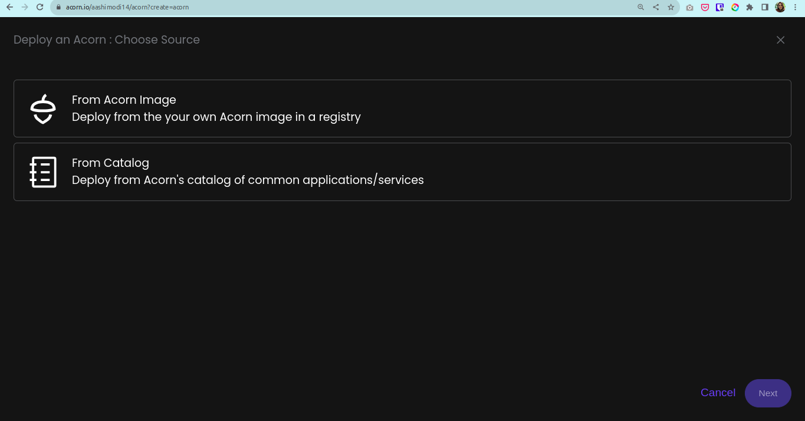

   3.2. Provide a name "syncthing-app”, use the default Region and provide the URL for the Acorn image and click `Deploy`.

   ```sh
   ghcr.io/infracloudio/syncthing-acorn:v#.#.#-#
   ```

   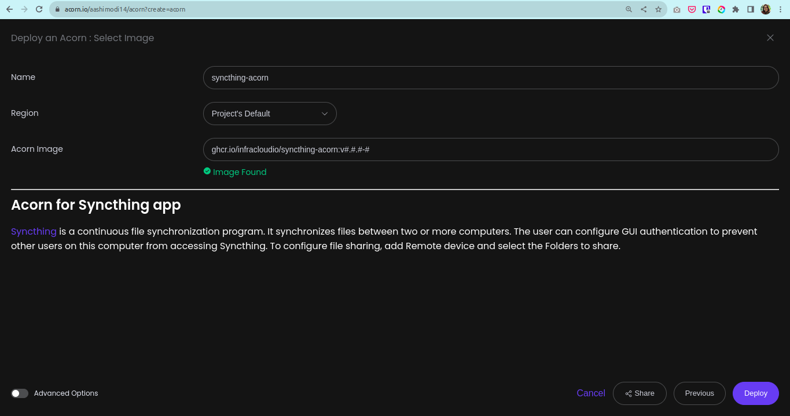


> _Note: The App will be deployed in the Acorn Sandbox Environment. As the App is provisioned on AcornPlatform in the sandbox environment it will only be available for 2 hrs and after that it will be shutdown. Upgrade to a pro account to keep it running longer_.
4. Once the Acorn is running, you can access it by clicking the `Endpoint` or the redirect link.

   4.1. Running Application on Acorn

   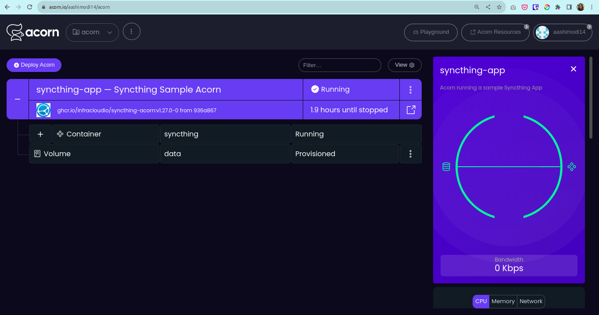

   4.2. Running Syncthing

   

## Deploying Using Acorn CLI

As mentioned previously, running the Acorn application using CLI lets you understand the Acornfile. With the CLI option, you can customize the Syncthing to your requirement or use your Acorn knowledge to run your own Syncthing Server in conjuction with other use-cases.

To run the application using CLI you first need to clone the source code repository on your machine.

```sh
$ git clone https://github.com/infracloudio/syncthing-acorn.git
```

Once cloned here’s how the directory structure will look.

```sh
.
├── Acornfile
├── LICENSE
├── README.md
└── syncthing_icon.png
```

### Understanding the Acornfile

To run the application we need an Acornfile which describes the whole application without all of the boilerplate of Kubernetes YAML files. The Acorn CLI is used to build, deploy, and operate Acorn on the Acorn cloud platform. It also can work on any Kubernetes cluster running the open source Acorn Runtime.

Below is the Acornfile for deploying the Syncthing that we created earlier:

```sh
containers: {
  syncthing: {
    image: "syncthing/syncthing"
    dirs: {
        "/var/syncthing": "volume://data"
    }

    env: {
      "TZ": "Etc/UTC"
      "PUID": "1000"
      "PGID":"1000"
    }
    ports: {
      publish: "8384:8384/http" 
      expose: ["22000:22000/tcp", "22000:22000/udp", "21027:21027/udp" ]
    }
  }
}

volumes: {
    "data": {
        size: 4G
    }
}
```

The above Acornfile has the following elements:

- **Containers**: We define syncthing container with following configurations:
  - **syncthing**:
    - **image**: Syncthing Image
    - **dirs**: Mount `data` volume to `/var/syncthing` for transfers. 
    - **env**: Environment Variables for the application.
    - **ports**: Published/Exposed ports for Syncthing.
- **Volumes**:
  - **data**: Empty Volume Mount for Syncthing Data

### Running the Application

Once you've logged using Acorn CLI you can directly deploy Syncthing on the Acorn platform Sandbox plan. Run the following command from the root of the directory.

```sh
$ acorn run -n syncthing-app .
```
Below is what the output looks like.


## Using Syncthing

The Syncthing is ready to be used for file synchronization between two or more computers in real time. On starting Syncthing, it is advisable to setup GUI Authentication and Password to prevent unauthorised access to your files. 

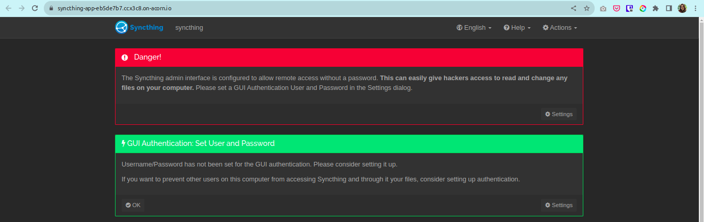
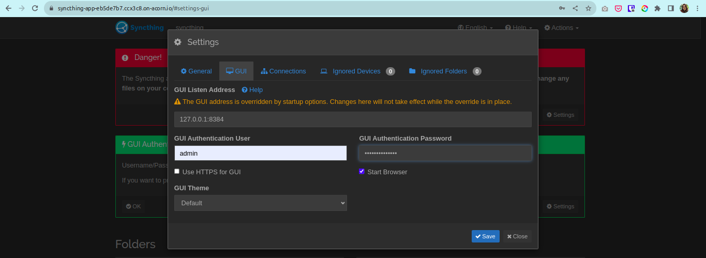


We will be using Syncthing to sync files from your Local File System to the Acorn Syncthing.
Pre-requisites: 
- Syncthing installed on your system
- Deploy Syncthing on Acorn

Steps:

- Start Syncthing in your system and on the GUI application, click on `Add Folder` like Syncthing-Demo and add details for the folder to sync like Folder Label and Folder Path
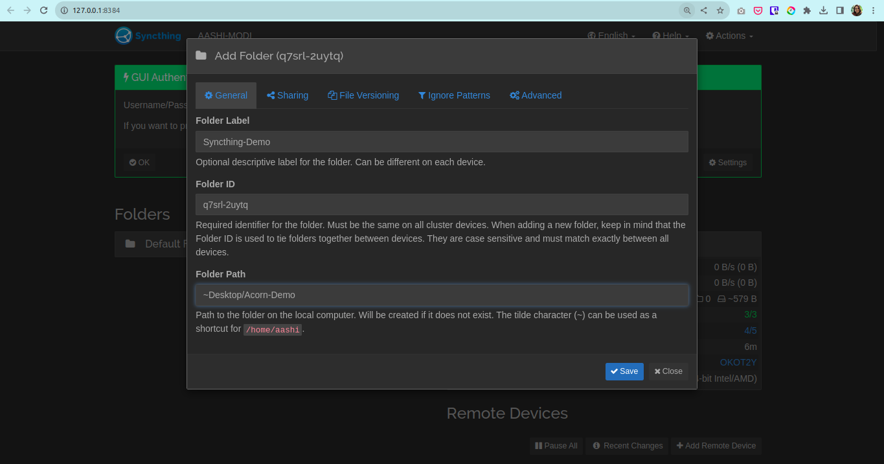 
- Retrieve Syncthing details to connect to Acorn Syncthing. Go to `Settings` -> `Show ID` and copy the unique Device ID code.
- On the Acorn Syncthing GUI application, click on `Add Remote Devices` to add Device ID and Device Name details and click `Save`.
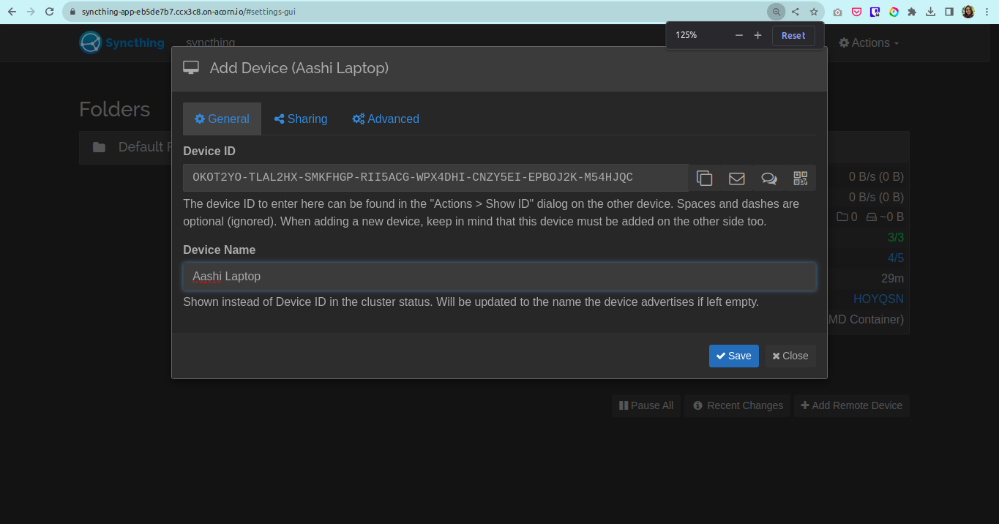
- Once, details are added, go to the system Syncthing GUI and allow the new device connection by clicking `add device` and save it.


- On the system Syncthing GUI, Click on newly Added folder and `Edit`-> `Sharing` and check on the added device, eg: `syncthing` device to enable sharing.

- Similarly, on the Acorn Syncthing GUI, need to allow sharing for remote folder and add the details for file storage.
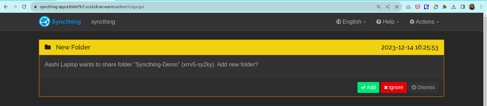
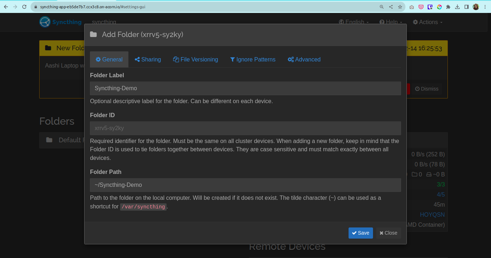
- Real Time Syncing successful.
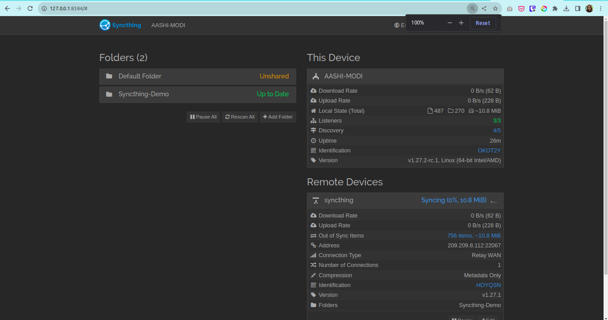
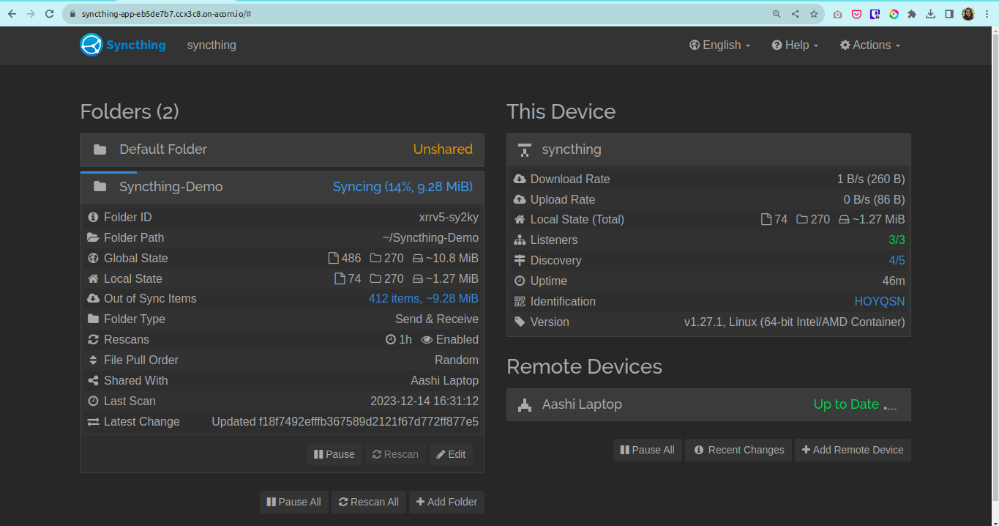

## What's Next?

1. Syncthing provisioned on Acorn Platform is available for two hours, you should upgrade to Pro account to keep it running for longer duration.
2. After deploying you can edit the Acorn Application or remove it if no longer needed. Click the `Edit` option to edit your Acorn's Image. Toggle the `Advanced Options` switch for additional edit options.
3. Remove the Acorn by selecting the `Remove` option from your Acorn dashboard.

## Conclusion

In this tutorial we learned how to use the Acornfile and run Syncthing. Also, different ways to deploy Syncthing using CLI and Dashboard approach.

Run Syncthing today and start real-time syncing of your favourite files!